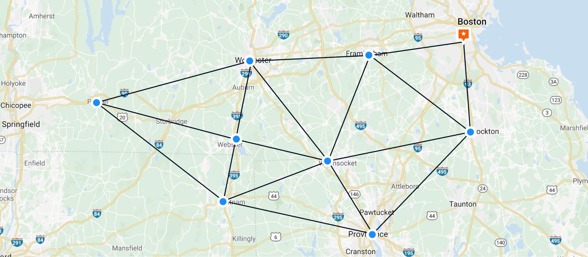

# Project1

Taking the rastrain function as an example, the range of independent variables x, y are both [-5,5], and the function graph is as follows:


The function has many extreme values. We try to design an evolutionary algorithm to find the minimum value.

The process of the evolutionary algorithm:

1. Suppose that the number of individuals in each generation of the population is a constant value n, and the genotype of each individual is (x, y)
2. Each individual undergoes a mutation (following a Gaussian or Cauchy probability distribution) to get a child
   1. The use of Gaussian probability distribution noise is Classic EP
   2. The use of Cauchy probability distribution noise is Fast EP
3. The parents and offspring are mixed to calculate the fitness, and the use tournament selection to select n individuals as the new generation
   1. The tournament selection here cycles n times, each time randomly selecting 3 individuals to compete for the winner
   2. I used resampling, which means that there may be duplicate individuals in the population
   3. This can ensure that the dominant genes can spread in the population, and also ensure that the weak genes have a chance to win, which is conducive to maintaining the diversity of the population and avoid falling into the local optimal solution
4. Repeat steps 1-3


## POP_SIZE

Take a look at the impact of population size on algorithm performance:

```python
POP_SIZE = [10,20,40,80]           # Population size
N_GENERATIONS = 600    # Number of generations
```

Note: The vertical axis represents fitness.The fitness here and the real value are the opposite. The smaller the fitness, the larger the real value.


It can be seen that the more individuals in the population, the easier it is to find the global optimal solution;

This is because, the more individuals in the population, the more solution spaces are covered, and the less likely they are to fall into the local optimal solution.

## EA_METHOD

```python
POP_SIZE = 40           # Population size
N_GENERATIONS = 600    # Number of generations
EA_METHOD=["EP","FEP"]
```


When the number of individuals in the population is 40, the EP algorithm did not find the optimal solution.


But FEP found the optimal solution; it can also be seen that FEP's fitness image is more tortuous;

The main reason is that: when mutating genes, the FEP algorithm uses the Cauchy probability distribution, while the EP algorithm uses the Gaussian probability distribution;


From the figure, it can be seen that compared with the Gaussian distribution, the Cauchy distribution has a larger tail, which means that it is more likely to generate random numbers far from the average value; this means that the FEP using the Cauchy distribution will generate larger mutated individuals, thereby exploring broader solution space and get the global optimal solution;

For rastrigin and most multimodal functions with many local optimal solutions, FEP performs better;

# Project2

The traveling salesman problem is: There are some cities in a region. How to go through all the cities without repetition, finally return to the original point, and the route is the shortest



Solving this problem with evolutionary algorithms:

0. Randomly generate several city points and calculate the distance matrix at the same time
1. Number the cities, the genotype of individuals in the population is all city numbers, different order of numbers means different paths
2. After the parental genes cross over and mutate, the offspring is obtained, and than use all individules'(patents and children) genotype to calculate the distance of the path and fitness
3. Use the tournament algorithm to select offspring
4. Repeat 1-3 until the specified number of iterations is reached


The size of the population represents the size of the solution space, and the larger the population, the easier it is to find the shortest distance.

The process of finding the shortest path is shown in the video:
<video controls>
  <source src="./project2/imgs/animation_2d.mp4" type="video/mp4">
</video>

<video  controls>
  <source src="./project2/imgs/animation_3d.mp4" type="video/mp4">
</video>